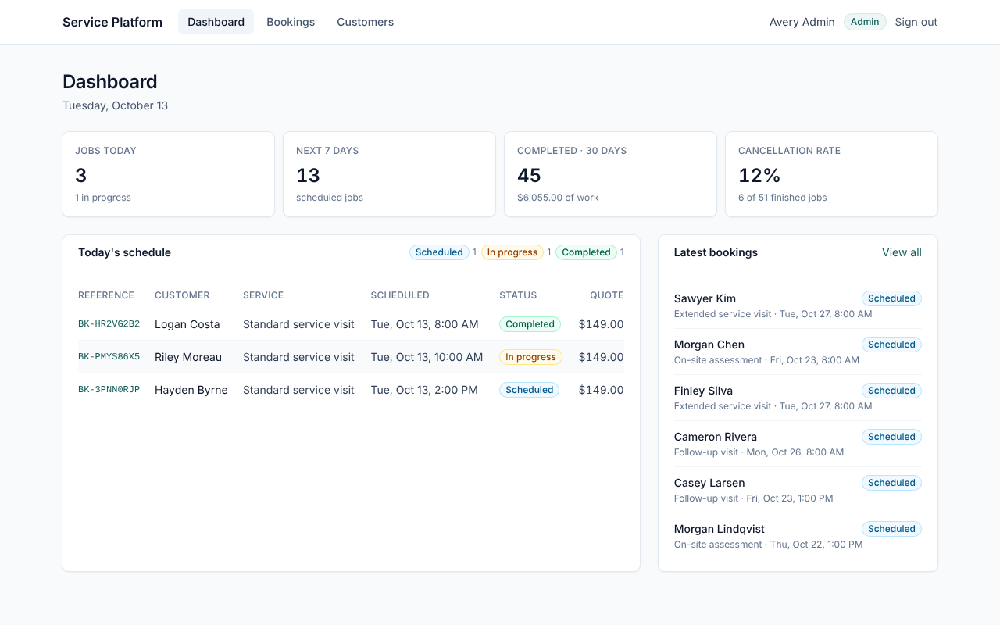
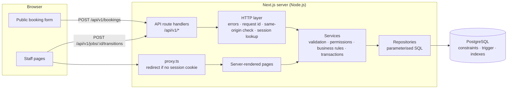
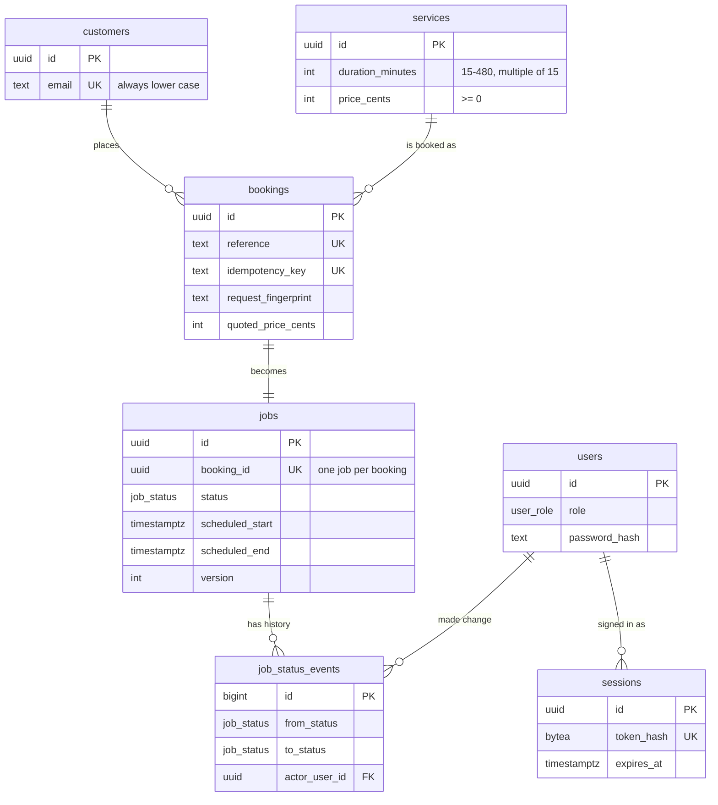
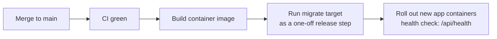
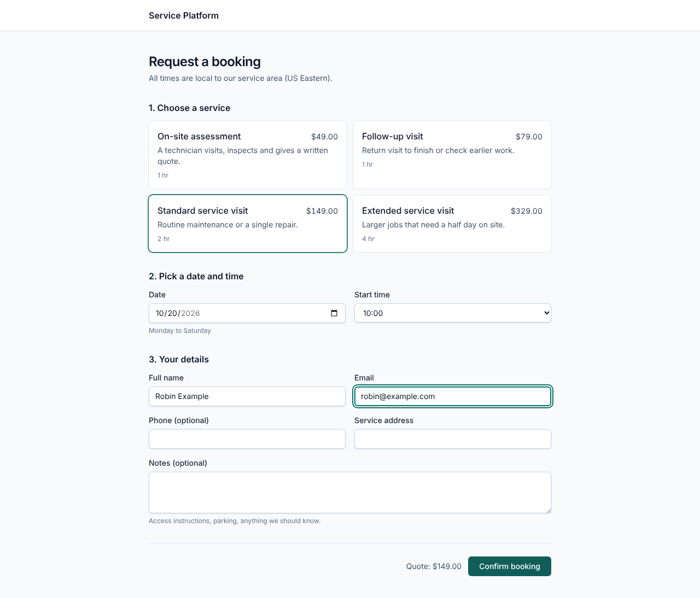
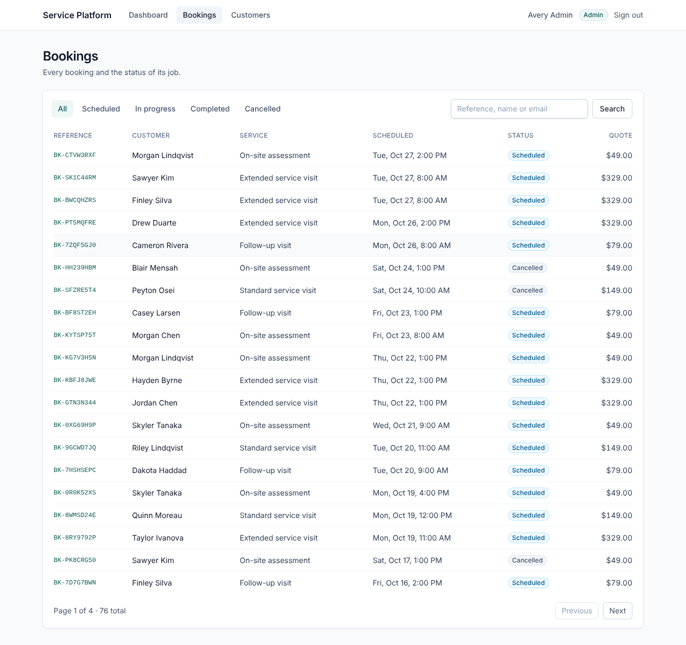
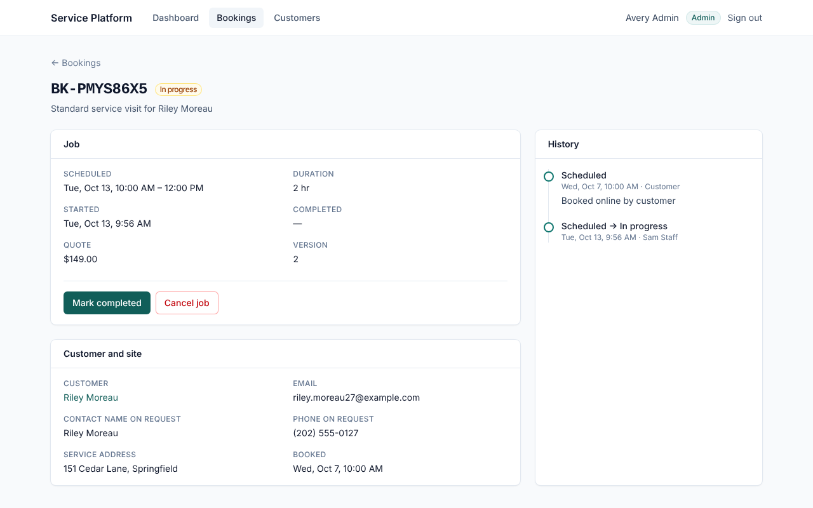
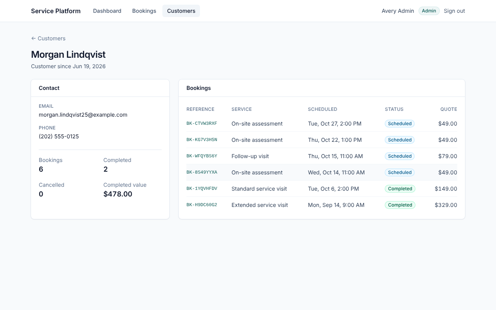
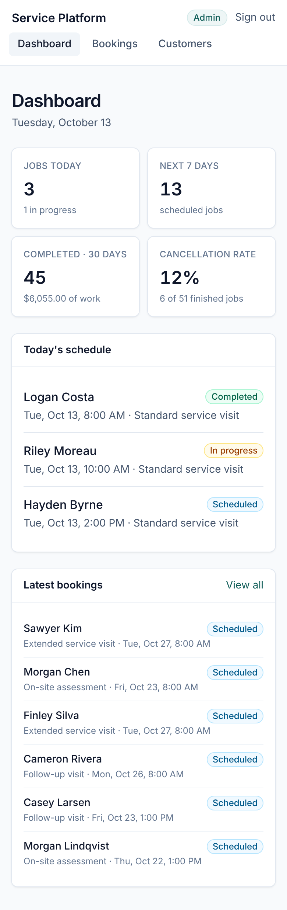

# Service Platform

[](https://github.com/ratchetnu/fullstack-service-platform/actions/workflows/ci.yml)

A small, complete web application for a business that sends crews out to do work: cleaning, repairs, inspections, installations. Customers book a visit online; staff see the schedule and move each job from *scheduled* to *in progress* to *completed*.

It is a portfolio project by **Timmothy Jones**, built to show one person owning a system end to end: the screens, the server, the database, security, tests and the automated pipeline. The business is fictional and every record in it is synthetic. The point is the engineering: how the pieces fit together, how the data stays correct when things go wrong, and how the whole thing is tested.



> **Short on time?** Look at the [screenshots](#11-screenshots), the table in [section 1](#1-what-this-project-demonstrates), and [`booking-service.ts`](src/server/services/booking-service.ts) with [its tests](tests/integration/booking-service.test.ts). Stack: TypeScript, Next.js, React, PostgreSQL, Playwright, GitHub Actions.

---

## The system in plain English

1. **A customer asks for a visit.** They pick a service, a date and a start time, and enter their contact details. No account is needed.
2. **The request is checked.** Is the business open then? Is there enough notice? Is a crew free? If anything is wrong, the customer is told exactly which field to fix.
3. **The request becomes a job.** If the checks pass, the system saves the customer, the booking and a scheduled job together, and shows the customer a reference number such as `BK-7F3K2Q9M`.
4. **Staff run the day.** Staff sign in to see today's schedule, find bookings and customers, and mark jobs as started and completed. Only an admin can cancel a job, and a cancellation needs a reason.
5. **Every change is recorded.** Each job keeps a history of who changed its status and when.

The core data model is: **Customer → Booking → Job → Status history.**

- A **booking** is what the customer asked for: the details they typed, the price they were quoted, and when they asked.
- A **job** is the work the business committed to: when it runs and what state it is in.

They are separate because they change for different reasons. The booking is a record of a request and never changes. The job is operational and changes all day.

---

## 1. What this project demonstrates

| Area | Where to look |
| --- | --- |
| A full product slice: public booking form, staff sign-in, dashboard, lists, detail pages | `src/app/` |
| A layered backend: HTTP → services → repositories → SQL | `src/server/` |
| A PostgreSQL schema that protects its own data: constraints, foreign keys, a trigger, purposeful indexes | `db/migrations/` |
| **Duplicate-proof retries (idempotency).** Sending the same booking twice never creates two bookings. | `src/server/services/booking-service.ts` |
| **All-or-nothing writes (transactions).** A booking is never saved without its job. | `src/server/db/transaction.ts` |
| **No double-booking under load (concurrency control).** Eight simultaneous requests for the last slot produce exactly the right number of jobs. | `lockScheduleDay` in `src/server/repositories/jobs.ts` |
| **Safe status changes.** Two people editing the same job cannot silently overwrite each other. | `src/server/services/job-service.ts` |
| **Rules the database enforces on its own.** A completed job cannot be moved back to scheduled, even with hand-written SQL. | `db/migrations/0003_job_status_transition_guard.sql` |
| Sign-in, sessions and role-based permissions, written from first principles | `src/server/auth/` |
| Unit, integration (real Postgres) and browser tests, all run in CI | `tests/`, `.github/workflows/ci.yml` |

---

## 2. Architecture



**Why it is shaped this way:**

- **One rulebook.** Pages and API routes both call the same service functions. Validation, permission checks and business rules live in the services, so every way into the system obeys the same rules, including future ones such as a background job or a mobile app.
- **SQL in one place.** Only repositories talk to the database. Services decide *what* should happen; repositories know *how* to store it.
- **Code shared with the browser is deliberately small.** The request schemas (`src/shared/schemas.ts`), the job lifecycle and the business hours are shared, so the form can give instant feedback using exactly the rules the server enforces. A lint rule stops browser code from importing anything under `src/server/`.

```
src/
  app/            Pages and API routes (Next.js App Router)
  components/     UI building blocks and the browser API client
  server/
    auth/         Passwords, sessions, permission policy
    db/           Connection pool, transaction helper, migration runner
    domain/       Small pure helpers (request fingerprints, booking references)
    http/         Route wrapper and error-to-HTTP mapping
    repositories/ SQL queries
    services/     Use cases: create booking, change job status, list, dashboard
  shared/         Code used by both browser and server
db/migrations/    Plain SQL, applied in order
scripts/          migrate, seed, reset, screenshots
tests/            unit/, integration/, e2e/
```

---

## 3. Request flow: creating a booking

This is the most involved request in the system. Here is what happens when a customer presses **Confirm booking**:

1. **In the browser**, the form checks the input with the same schema the server uses. It then sends the request with an `Idempotency-Key` header: a random ID created for this submission. If the network fails, the browser retries with the **same** key. If the customer edits the form, a new key is created.
2. **The route handler** (`src/app/api/v1/bookings/route.ts`) is three lines. The shared `route()` wrapper assigns a request ID, rejects cross-site requests, parses JSON and turns any error into a consistent JSON response.
3. **The booking service** (`createBooking`):
   1. Validates the body and normalises it (trims spaces, lower-cases the email).
   2. Computes a *fingerprint* (a hash) of the normalised request. If this key has been seen before with the same fingerprint, it returns the original booking. That is a retry. If the fingerprint differs, the key was reused by mistake and the request is refused.
   3. Opens a database transaction and:
      - checks the service exists and is still offered;
      - checks the business rules (open day, opening hours, notice period, how far ahead);
      - takes a lock on that calendar day, so requests for the same day are handled one at a time;
      - checks the idempotency key again (an identical request may have just finished);
      - counts the jobs overlapping that time and refuses if every crew is busy;
      - finds or creates the customer, then inserts the booking, the job and the first history entry.
   4. Commits. Either all four rows are saved, or none are.
4. **The response** is `201 Created` for a new booking, or `200 OK` with `Idempotent-Replayed: true` for a retry.

Changing a job's status follows the same path through `transitionJob`, which locks the job's row and checks the version number the user last saw (see §9).

---

## 4. Database design



**The database defends itself.** The application checks everything, but the schema also refuses bad data on its own, in case of a bug, a script or someone running SQL by hand:

| Rule | How it is enforced |
| --- | --- |
| A job's status can only move forward (scheduled → in progress → completed; scheduled or in progress → cancelled) | Trigger `jobs_status_transition_guard` |
| A job's timestamps match its status (a completed job has a start and finish time, and finished after it started) | `CHECK jobs_status_timestamps` |
| A cancelled job has a reason, and only a cancelled job has one | `CHECK jobs_cancellation_reason` |
| A job ends after it starts | `CHECK jobs_schedule_window` |
| A booking has at most one job | `UNIQUE (booking_id)` |
| An idempotency key is used once | `UNIQUE (idempotency_key)` |
| Emails are unique regardless of capitals | Stored lower case (`CHECK`) plus `UNIQUE` |
| A customer with bookings cannot be deleted | Foreign keys with `ON DELETE RESTRICT` |

Integration tests (`tests/integration/schema-invariants.test.ts`) bypass the application and try each of these with raw SQL.

**The lookups that must stay fast each have an index** (a sorted lookup structure the database keeps up to date):

- `jobs (status, scheduled_start)` for the bookings list filtered by status and ordered by time.
- `jobs (scheduled_start, scheduled_end) WHERE status IN ('scheduled','in_progress')` for the capacity check. It is a *partial* index: finished and cancelled jobs, which will be most rows over time, are never in it.
- `bookings (customer_id, created_at DESC)` for a customer's booking history.
- Every foreign key column is indexed. Postgres does not do this automatically, and a test fails if one is missed.

**Two deliberate modelling choices:**

- **The booking keeps a copy of the price.** `quoted_price_cents` is the price at the moment of booking, so raising a price later does not rewrite past bookings.
- **The booking keeps the contact details as typed.** The form is public, so anyone can type anyone's email. Saved customer details are therefore never overwritten by a form submission. The booking keeps what this request said, and the customer record keeps what was first saved.

**Schema changes are numbered SQL files applied in order** (migrations), run by a small runner (`src/server/db/migrator.ts`, about 120 lines). Each file runs in its own transaction. Applied files are recorded with a checksum, so editing a migration that has already run is caught rather than silently skipped. An advisory lock stops two deploys from migrating at once.

---

## 5. API structure

All endpoints are under `/api/v1` and return JSON. Errors always look like this:

```json
{
  "error": {
    "code": "VALIDATION_FAILED",
    "message": "Some fields are invalid.",
    "fields": { "customer.email": "Please enter a valid email address." },
    "requestId": "2f6c…"
  }
}
```

`code` is stable and meant for programs; `message` is meant for people. Unexpected errors are logged in full on the server, with the request ID. The client only receives a generic message, never internal details.

| Method | Path | Who | Purpose |
| --- | --- | --- | --- |
| `GET` | `/api/health` | anyone | Liveness and database check |
| `GET` | `/services` | anyone | Services a customer can book |
| `POST` | `/bookings` | anyone | Create a booking. **Requires `Idempotency-Key`.** `201` new, `200` replay |
| `GET` | `/bookings?status=&q=&page=` | staff | List, filter, search, paginate |
| `GET` | `/bookings/:id` | staff | Booking, job and status history |
| `POST` | `/jobs/:id/transitions` | staff (cancel: admin) | `{ "to": "in_progress", "expectedVersion": 1, "reason"?: "…" }` |
| `GET` | `/customers?q=&page=` | staff | List and search customers |
| `GET` | `/customers/:id` | staff | Customer, totals and bookings |
| `GET` | `/dashboard` | staff | Today, next 7 days, last 30 days |
| `POST` | `/auth/login` · `/auth/logout` | — | Start or end a session |
| `GET` | `/auth/me` | staff | The signed-in user |

| Status | Meaning here |
| --- | --- |
| `400` | Invalid input, malformed JSON or a missing idempotency key |
| `401` / `403` | Not signed in / signed in but not allowed |
| `404` | No such record (including malformed IDs) |
| `409` | The slot is full, the status change is not allowed, or someone else changed the job first |
| `422` | Valid input that breaks a business rule, or an idempotency key reused for a different request |

---

## 6. Authentication and authorization

**Authentication: who are you?** Staff sign in with email and password.

- Passwords are stored as **scrypt** hashes, using the algorithm built into Node.js, each with its own random salt. scrypt is deliberately slow, which makes guessing passwords from a stolen database expensive.
- Signing in creates a **server-side session**. The browser receives a random token in a cookie that JavaScript cannot read (`HttpOnly`) and that browsers do not send on cross-site form posts (`SameSite=Lax`). The cookie is `Secure` in production.
- The database stores only a **hash of the token**. A leaked copy of the sessions table cannot be used to sign in. Sessions expire after 12 hours (configurable) and are deleted on sign-out.
- A wrong password and an unknown email get the same message *and take the same time*, so the form cannot be used to discover who has an account.

**Authorization: what may you do?** There are two roles, defined in one small file (`src/server/auth/policy.ts`):

| | Staff | Admin |
| --- | :-: | :-: |
| View dashboard, bookings, customers | ✓ | ✓ |
| Start and complete jobs | ✓ | ✓ |
| Cancel jobs | | ✓ |

Permissions are checked **inside the service functions**, not in the pages. The request proxy (`src/proxy.ts`) only redirects visitors without a cookie to the sign-in page. It is a convenience, not a security boundary. The real check happens wherever data is read or changed.

**Other protections:** state-changing requests from another website are rejected by checking the `Origin` header; the post-login redirect only accepts paths on this site (preventing an "open redirect"); IDs in URLs are validated before they reach SQL; all SQL is parameterised; basic security headers are set in `next.config.ts`.

**Demo accounts** (seeded; shown on the sign-in page because this is a public demo):

| Role | Email | Password |
| --- | --- | --- |
| Admin | `admin@example.com` | `admin-demo-password` |
| Staff | `staff@example.com` | `staff-demo-password` |

---

## 7. Testing strategy

Each layer of tests answers a different question.

| Layer | Count | Runs against | Answers |
| --- | --: | --- | --- |
| **Unit** (`tests/unit`) | 71 | Nothing external, under a second | Are the rules right? Time zones and daylight saving, opening hours, the job lifecycle, input validation, password hashing, permissions, retry logic, error formatting, redirect safety, migration planning. |
| **Integration** (`tests/integration`) | 51 | A real PostgreSQL database, recreated from the migrations on every run | Does it hold up against the real database? Idempotent replays, concurrent duplicate requests, capacity under concurrent load, rollback when a step fails, conflicting edits, schema invariants via raw SQL, sessions, HTTP status codes and cookies from the real route handlers. |
| **End-to-end** (`tests/e2e`) | 3 | A production build in a real browser (Playwright) | Does it work for a person? A customer books; staff find the booking; staff start a job but cannot cancel it; sign-in redirects back to the page asked for. |

Some of the tests worth reading:

- **"never overbooks under concurrent load"** fires eight booking requests for the same slot at once and expects exactly three to succeed (three crews). With the day lock removed, this test fails. That was checked while writing it.
- **"creates exactly one booking when identical retries arrive at the same moment"** sends eight copies of one request with the same key at once.
- **"writes nothing if a later step fails"** installs a temporary database trigger that makes the *last* insert fail, then checks that no customer, booking or job was left behind. This tests rollback without adding test-only code to the application.

The database is never mocked in integration tests. Mocks would hide exactly the behaviour these tests exist to check: locking, constraints and transactions.

---

## 8. Automated checks and deployment (CI/CD)

**Every change is checked automatically before it can be merged** (continuous integration). The workflow in `.github/workflows/ci.yml` runs on every pull request and every push to `main`, as three parallel jobs:

1. **Static checks:** lint, typecheck, unit tests, and `npm audit` of production dependencies.
2. **Integration:** a PostgreSQL 16 service container, migrations from scratch, integration tests.
3. **End-to-end:** production build (`next build`), then Playwright against it with a seeded database. The HTML report is uploaded if anything fails.

Locally, `npm run check` runs lint, typecheck, unit and integration tests, and the production build in one go.

**How it would be released** (continuous delivery; nothing is deployed from this repository):



- `Dockerfile` packages the app as a small container image that runs as a non-root user, built from Next.js's self-contained ("standalone") output. A separate `migrate` target applies database changes. Both targets have been built and run locally against PostgreSQL.
- **Migrations run before the new code receives traffic**, as their own step, never on app start-up. This means many app instances never race to migrate.
- Migrations are written to be backward-compatible with the previous release (add first, remove later), so a deploy can be rolled back without touching the database.
- The app is stateless; all state is in PostgreSQL. It scales horizontally behind a load balancer on any container platform with a managed Postgres.

---

## 9. Important engineering decisions

**Retrying a booking never creates a duplicate** (idempotency keys). Networks fail. If a customer's request times out, they or their browser will try again, and they must not end up with two bookings. Every booking request carries a key, and the key is stored with the booking under a unique constraint. A retry returns the original booking. Reusing a key for a *different* request is refused rather than silently ignored. Concurrent retries are handled too: the first transaction to insert wins, and the others read its result.

**Two customers cannot take the last crew at the same moment** (a lock per calendar day). Checking "is a crew free?" and then saving is a classic race: two requests can both see "two of three crews busy" and both take the last crew. So bookings for the same day queue up briefly and are checked one at a time, using a Postgres advisory lock. Bookings for different days never wait for each other, and because jobs cannot run past midnight, one lock per day covers every possible overlap.

**Two staff members cannot overwrite each other's changes** (a row lock plus a version number). While one change is being saved, the job is locked (`SELECT … FOR UPDATE`), which protects the *data*. Each job also has a version number, which protects the *people*: if you are looking at a job someone else has since changed, your click is refused with "refresh to see the latest" instead of silently undoing their work. Asking for the status a job already has succeeds without changing anything, so double-clicks and retries are harmless.

**A brief database conflict is retried automatically** (a retrying transaction helper). `withTransaction` saves a group of changes together or not at all, and if Postgres reports that two transactions collided (a serialisation failure or deadlock), it runs the whole group again. That is only safe because the work inside is itself safe to repeat, which is exactly what the idempotency key and the status no-op guarantee.

**The most important rule is enforced twice, on purpose.** The job lifecycle is checked by the application, which gives people a clear error message, *and* by the database (a trigger), which guarantees it even if the application has a bug. The duplication is a few lines, and it makes an entire class of data corruption impossible.

**Database queries are written by hand** (plain SQL instead of an ORM, a library that generates SQL). The interesting parts of this system are SQL features: partial indexes, advisory locks, `FOR UPDATE`, `ON CONFLICT`, check constraints, triggers. Writing the SQL directly keeps them visible and reviewable. Repositories return typed objects, so the rest of the code never sees raw rows.

**Times are always the business's local time.** Customers pick "Tuesday at 10:00". That means 10:00 where the business is, regardless of where the customer's browser is. The API accepts a local date and time and the server converts it to an exact instant using the platform's `Intl` API (tested across daylight-saving changes). Everything is stored as `timestamptz`.

**Few third-party packages** (dependencies). Runtime dependencies are Next.js, React, `pg` and Zod. Password hashing, session tokens, time-zone handling and migrations use the Node.js standard library. Each is short, tested and easy to audit.

---

## 10. Running locally

Requirements: **Node.js 22+** and **PostgreSQL 16** (or Docker).

```bash
# 1. Start Postgres (or use your own and adjust .env)
docker compose up -d

# 2. Install and configure
npm ci                  # installs the exact versions in package-lock.json
cp .env.example .env

# 3. Create the schema and demo data
npm run db:reset        # creates the database if needed, migrates, seeds

# 4. Run
npm run dev             # http://localhost:3000
```

Open <http://localhost:3000/book> to make a booking, or <http://localhost:3000/login> and use a demo account.

| Command | What it does |
| --- | --- |
| `npm run lint` · `npm run typecheck` | Static checks |
| `npm run test:unit` | Unit tests (no database needed) |
| `npm run test:integration` | Integration tests; recreates the database in `TEST_DATABASE_URL` |
| `npm run build && npm run test:e2e` | Browser tests against a production build (first time: `npx playwright install chromium`) |
| `npm run check` | Lint, typecheck, unit and integration tests, build |
| `npm run db:migrate` | Apply pending migrations |
| `npm run db:seed` · `npm run db:reset` | Seed an empty database / start over |

Seed data is generated relative to today: about a month of history and two weeks of upcoming work.

---

## 11. Screenshots

The screenshots are generated by a script (`npm run build && npm run screenshots`) that seeds a separate database and runs the app with a demo clock set to 11:30 on a Tuesday, so they always show a working day in progress: one job finished, one running, one still to come.

| | |
| --- | --- |
| **Booking form** (public)  | **Bookings list** with status filters and search  |
| **Booking detail**: job, actions, history  | **Customer detail**: totals and booking history  |
| **Dashboard on a phone**  | |

---

## 12. What I would change for enterprise scale

The current design is right for one business with a handful of staff. Here is what I would change as the load, the team or the stakes grow, roughly in the order I would do it:

- **Sign-in through the company's identity provider.** Replace passwords with single sign-on (OIDC/SAML) and multi-factor authentication, and keep the roles in the identity provider. The permission policy in `policy.ts` would stay the same; only where roles come from would change.
- **Limits on how often one visitor can submit forms** (rate limiting) and bot protection on the public booking and sign-in endpoints, at the edge (an API gateway or web application firewall), plus account lockout after repeated failed sign-ins. This is deliberately left out of the demo: it belongs in infrastructure rather than application code, and an in-memory version would not work across several servers.
- **Seeing what the system is doing in production** (observability). Send the existing structured logs and request IDs into a central log store, and add OpenTelemetry tracing and metrics: booking success rate, rejection reasons, lock wait time, p95 latency. Alert on error rate and on `/api/health`.
- **Real scheduling.** Model crews and skills explicitly, with a Postgres exclusion constraint so a single crew can never be double-booked at the database level. The current day-level lock would become per-crew or per-region.
- **Sending emails and notifications reliably** (an event outbox). Confirmation emails, SMS and integrations such as billing should not happen inside the booking request. Write an event to an *outbox* table in the same transaction, and have a worker deliver it with retries. Messages are then neither lost nor sent twice.
- **Handling much more data** (database scaling). Keyset (cursor) pagination instead of page numbers; read replicas for the dashboard and reporting; partitioning or archiving `job_status_events` by month; connection pooling with PgBouncer; a scheduled job to purge expired sessions.
- **Several businesses on one platform** (multi-tenancy): a `tenant_id` on every table plus Postgres row-level security, so isolation does not depend on every query remembering a `WHERE`.
- **A published, machine-readable description of the API** (OpenAPI). Generate an OpenAPI document from the Zod schemas and publish typed clients; version the API formally.
- **Safer releases.** Preview environments per pull request, a staging environment with production-like data volumes, canary or blue/green releases, infrastructure as code (Terraform), secrets in a managed vault, and a Content Security Policy.
- **Privacy and compliance.** Data retention rules and an audit of who viewed customer personal data, not only who changed it.

---

## License

MIT © 2026 Timmothy Jones. See [LICENSE](LICENSE). All names, emails, addresses and phone numbers in this repository are synthetic (`example.com`, `555` numbers).

---

Built by **Timmothy Jones** · [github.com/ratchetnu](https://github.com/ratchetnu)
